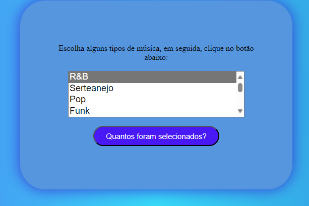

# Laco-For-Music

## Descrição 📖

 Este repositório contém um exemplo de implementação de um laço de repetição `for` em JavaScript, aplicado à exibição de músicas. Além disso, foram incluídos mais alguns tipos de música para expandir a funcionalidade do código original. 
 
 ## Introdução 🔧 
 
 O código neste repositório demonstra o uso básico do laço de repetição `for` em JavaScript para exibir uma lista de músicas. A inclusão de mais tipos de música amplia a variedade de gêneros apresentados. 

 
 
 ## Funcionalidades 🧠 
 
 - Implementação de um laço de repetição `for` para exibição de músicas. 
 - Inclusão de alguns novos tipos de música para diversificar a lista. 
 - Facilidade de compreensão e uso do código para iniciantes em JavaScript. 
 
 ## Tecnologias Utilizadas 💻 
 - Visual Studio Code; 
 - CSS3; 
 - GitHub; 
 - Git; 
 - HTML5; 
 - JavaScript. 
 
 
## Autores 📚
- Github: [Nicolas Tonassi](https://github.com/nicolas-tonassi); LinkedIn: [Nicolas Tonassi](https://www.linkedin.com/in/nicolas-tonassi-b70a50261?utm_source=share&utm_campaign=share_via&utm_content=profile&utm_medium=android_app)
- [Murilo Tonassi](https://github.com/murilo-tonassi)
- [Pamela Souza](https://github.com/PamelaSouzaSilva)